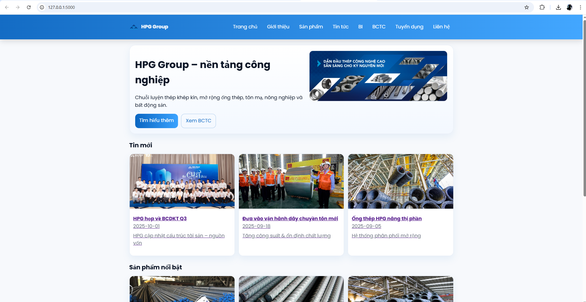
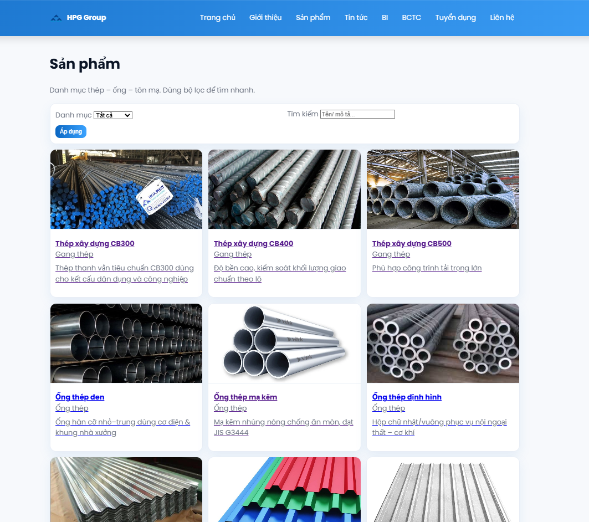
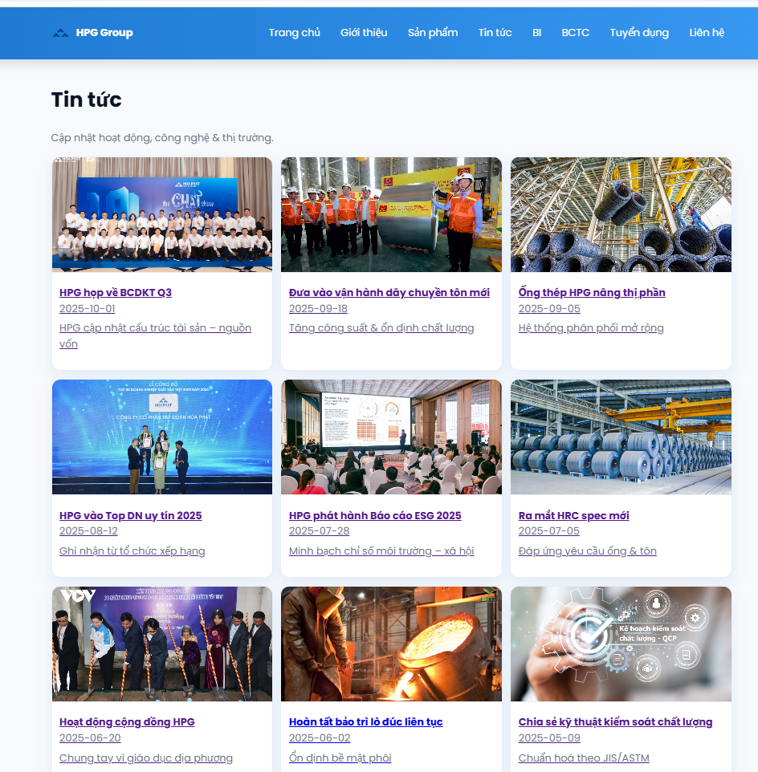
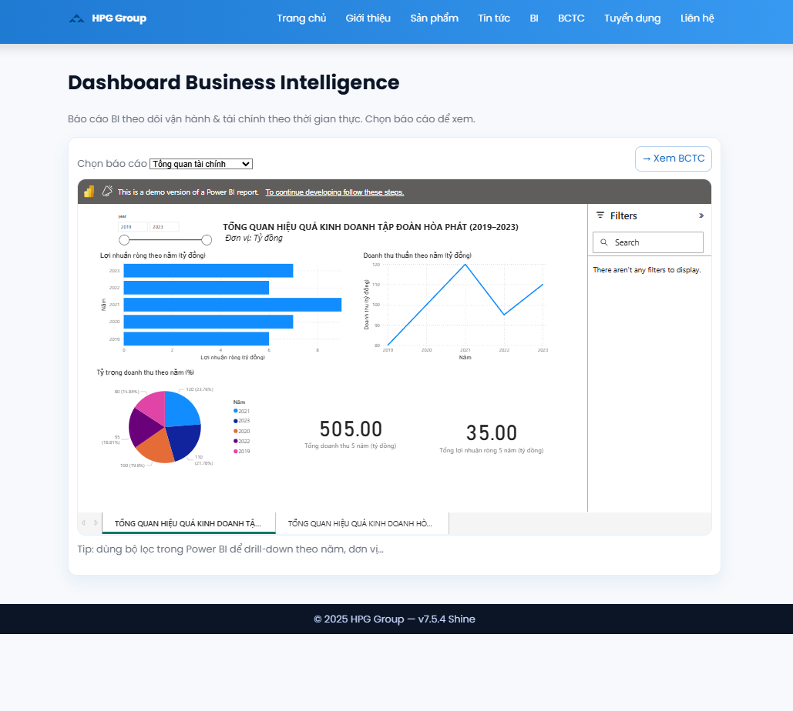
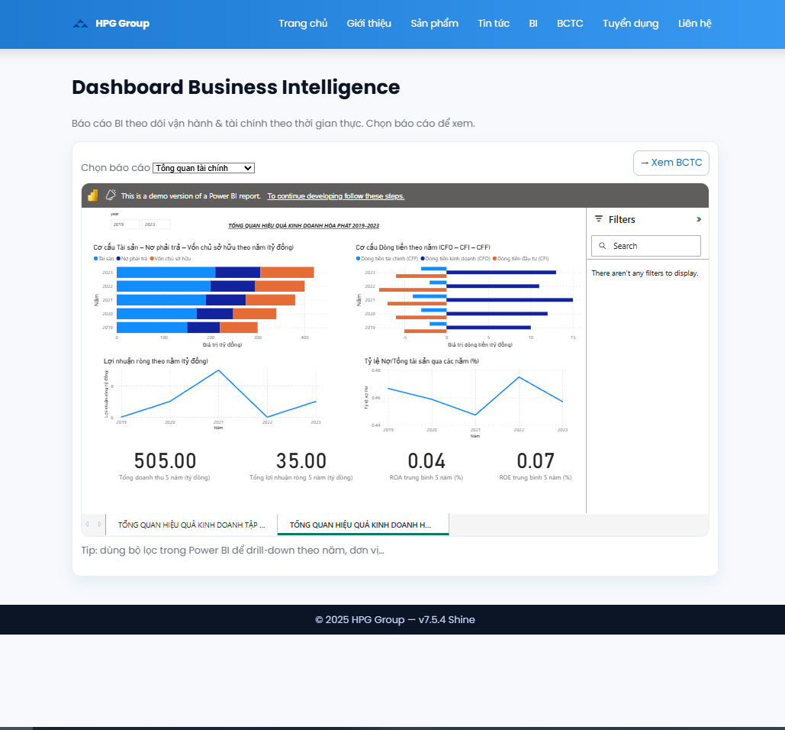
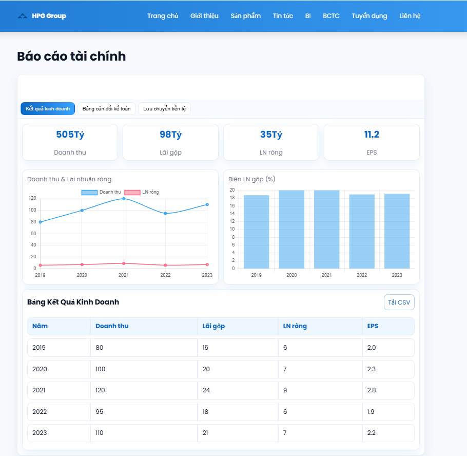
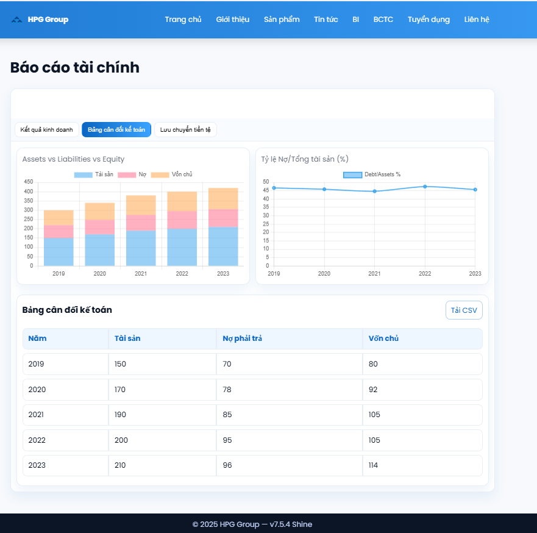
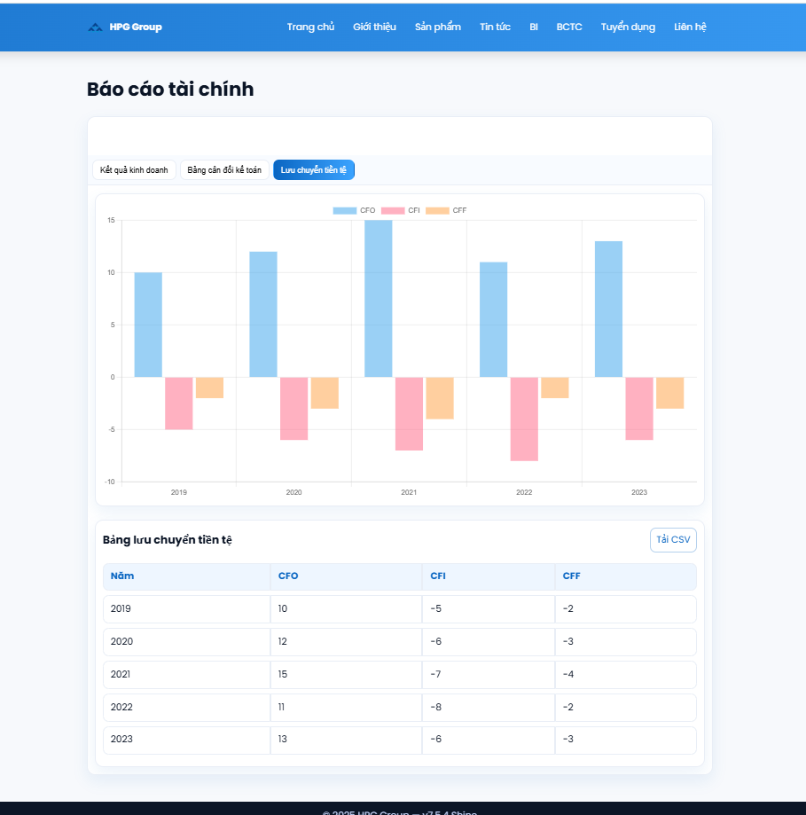

<h2 align="center">
    <a href="https://dainam.edu.vn/vi/khoa-cong-nghe-thong-tin">
    🎓 Faculty of Information Technology (DaiNam University)
    </a>
</h2>
<h2 align="center">
    HỆ THỐNG PHÂN TÍCH TÀI CHÍNH HÒA PHÁT – WEB FLASK + POWER BI
</h2>
<div align="center">
    <p align="center">
        
        
        
    </p>

[](https://www.facebook.com/DNUAIoTLab)
[](https://dainam.edu.vn/vi/khoa-cong-nghe-thong-tin)
[](https://dainam.edu.vn)

</div>

---

## 📖 1. Giới thiệu hệ thống
Dự án **Phân tích tài chính Tập đoàn Hòa Phát (HPG)** được xây dựng nhằm đánh giá hiệu quả hoạt động kinh doanh giai đoạn **2019–2023**, thông qua các báo cáo:
- Báo cáo kết quả kinh doanh  
- Bảng cân đối kế toán  
- Báo cáo lưu chuyển tiền tệ  

Hệ thống gồm hai phần chính:
- **Web Flask**: hiển thị giao diện doanh nghiệp, sản phẩm, tin tức, báo cáo tài chính và dashboard BI.
- **Power BI Dashboard**: trình bày dữ liệu trực quan, phân tích xu hướng tài chính theo thời gian.

Trang web giúp người dùng theo dõi **doanh thu, lợi nhuận, tài sản, nợ, ROA, ROE, dòng tiền**, hỗ trợ việc **phân tích dữ liệu và ra quyết định kinh doanh**.

---

## 🔧 2. Công nghệ sử dụng
#### 💻 Ngôn ngữ & Framework:
- **Python 3.11 + Flask** – xử lý backend và định tuyến trang  
- **HTML5 / CSS3 / Bootstrap 5** – thiết kế giao diện hiện đại  
- **JavaScript** – tạo tương tác động  
- **Power BI Embedded** – tích hợp dashboard tài chính trực quan  
- **Pandas / Numpy** – xử lý dữ liệu tài chính

#### 💾 Cơ sở dữ liệu:
- SQLite / PostgreSQL dùng để lưu trữ thông tin doanh nghiệp, báo cáo và sản phẩm.

#### 📊 Dữ liệu tài chính:
- Dữ liệu 5 năm (2019–2023) gồm doanh thu, lợi nhuận, EPS, tài sản, nợ phải trả, vốn chủ và lưu chuyển tiền tệ (CFO, CFI, CFF).

---

## 🚀 3. Cấu trúc & Cài đặt hệ thống
#### Cấu trúc thư mục:
```
hoaphat_bi_flask/
│
├── app.py                 # File Flask chính
├── requirements.txt       # Danh sách thư viện
├── static/                # CSS, JS, hình ảnh
├── templates/             # Giao diện HTML
├── data/                  # File dữ liệu (CSV/JSON)
└── venv/                  # Môi trường ảo
```

#### Cài đặt:
1️⃣ **Tạo môi trường ảo và cài thư viện**
```bash
python -m venv venv
venv\Scripts\activate
pip install -r requirements.txt
```

2️⃣ **Chạy web Flask**
```bash
python app.py
```

3️⃣ **Mở trình duyệt**:  
👉 http://127.0.0.1:5000  

---
## 💡 4. Giao diện và Dashboard

<figure align="center">
  
  <figcaption><em>Hình 1: Trang chủ Hòa Phát Group – nền tảng công nghiệp</em></figcaption>
</figure>

<figure align="center">
  
  <figcaption><em>Hình 2: Giới thiệu tầm nhìn & sứ mệnh, chuỗi giá trị luyện thép khép kín</em></figcaption>
</figure>

<figure align="center">
  
  <figcaption><em>Hình 3: Trang sản phẩm – Thép xây dựng, ống thép, tôn mạ</em></figcaption>
</figure>

<figure align="center">
  
  <figcaption><em>Hình 4: Trang tin tức – Cập nhật hoạt động và công nghệ HPG</em></figcaption>
</figure>

<figure align="center">
  
  <figcaption><em>Hình 5: Dashboard Power BI – Tổng quan hiệu quả kinh doanh (2019–2023)</em></figcaption>
</figure>

<figure align="center">
  
  <figcaption><em>Hình 6: Dashboard tài chính – Phân tích cơ cấu tài sản và lợi nhuận</em></figcaption>
</figure>

<figure align="center">
  
  <figcaption><em>Hình 7: Báo cáo tài chính – Kết quả kinh doanh 5 năm gần nhất</em></figcaption>
</figure>

<figure align="center">
  
  <figcaption><em>Hình 8: Bảng cân đối kế toán – Tài sản, nợ và vốn chủ sở hữu</em></figcaption>
</figure>

<figure align="center">
  
  <figcaption><em>Hình 9: Báo cáo lưu chuyển tiền tệ – Dòng tiền từ hoạt động kinh doanh</em></figcaption>
</figure>

<figure align="center">
  
  <figcaption><em>Hình 10: Trang tuyển dụng – Biểu mẫu ứng tuyển và gửi CV</em></figcaption>
</figure>


---
## 🧮 5. Tính năng chính
- Hiển thị **chuỗi giá trị luyện thép khép kín**  
- Cập nhật **tin tức Hòa Phát mới nhất**  
- Trình bày **báo cáo tài chính 5 năm** (2019–2023)  
- Phân tích **chỉ số ROA, ROE, EPS, D/E, biên lợi nhuận**  
- Dashboard Power BI giúp **theo dõi dữ liệu theo thời gian thực**

--
## 6. Thông tin liên hệ

**Mọi Thắc Mắc Vui Lòng Liên Hệ Theo Thông Tin Bên Dưới Dưới**

**Trường**: Đại Học Đại Nam

**Tác Giả**: Dương Xuân Thành

**Lớp**: CNTT 16-01

**SDT**: 0973002568
**EMAIL**: duongxuanthanh029@gmail.com
    
© 2025 AIoTLab, Faculty of Information Technology, DaiNam University. All rights reserved.

